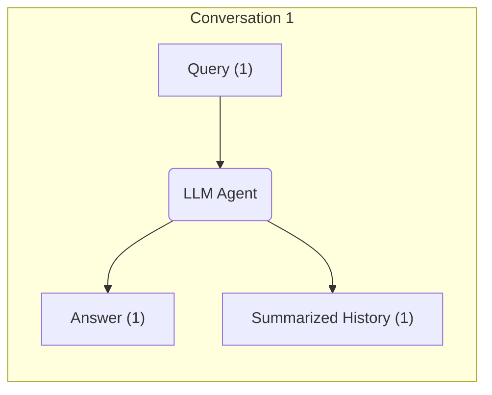
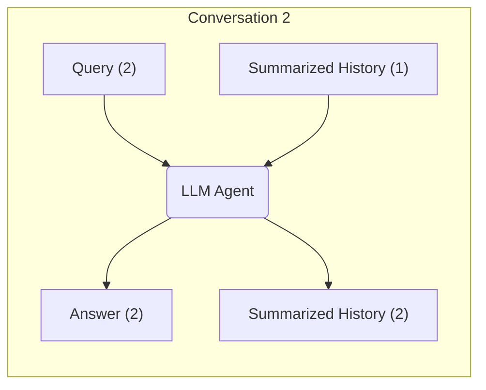

# Introduction to LLMs and Agents

---
layout: statement
---

## What is an LLM and How Does It Work?

1. **Data Collection**: Large volumes of text (books, articles, web pages) are gathered as raw material.
2. **Tokenization**: Text is split into small units called tokens (words or parts of words).
3. **Embedding**: Each token is converted into a numerical vector (embedding) that captures its meaning and context, enabling the model to understand semantic relationships.
4. **Training**: The model learns to predict the next token in a sequence, optimizing its internal parameters to minimize errors.
5. **Fine-tuning**: The model can be further trained on specific data to specialize in certain tasks or domains.
6. **User Interaction**: When a user submits a prompt, it is tokenized and embedded, then processed by the model.
7. **Response Generation**: The LLM generates a response by predicting the most likely next tokens based on context and learned embeddings.

<!--
We all know that Large Language Models (LLMs) work by predicting the next token.

-->


---
layout: default
---

# Tokens, embeddings and parameters: an example

> "A Bologna, mangiano le lasagne."

**Tokenization:**
["A", "Bologna", "mangiano", "le", "lasagne", "."]

**Embedding:**
Each word becomes a vector.
- "Bologna" → [0.2352, 0.2967, 0.36237, ...]
- "lasagne" → [0.18632, -0.125, 0.3242, ...]

**Similarity** 0.723647

**Semantic closeness:**
If the vectors for "Bologna" and "lasagne" are close, the model has learned they are related (e.g., typical food of the city).

**Parameters:**
These are the numbers that allow the model to organize these "closenesses" between concepts.


---
layout: full
---

# Demo Resources

- https://huggingface.co/spaces/Xenova/the-tokenizer-playground
- https://andreban.github.io/temperature-topk-visualizer/
- https://www.cs.cmu.edu/~dst/WordEmbeddingDemo/


---
layout: default
---

# Evolution from simple text generation to complex reasoning

- IBM alignment models (1990)
- GPT-1 (2018) 117 million parameters
- GPT-2 (2019) 1.5 billion parameters
- GPT-3 (2020) 175 billion parameters
- GPT-4 (2023) 1 trillion parameters?
- Gemini 2.5 (2024) ??
- Claude 3.7 (2025) ??
- More... ??

<br>
Good Read: <a href="https://transformer-circuits.pub/2025/attribution-graphs/biology.html">On the Biology of a Large Language Model</a>


<!--
A brief history of LLMs

Before 2017, language models were limited in size and capability, with early examples like IBM's statistical models from the 1990s.

The introduction of the Transformer architecture in 2017 marked a significant advancement, enabling LLMs to tackle complex tasks such as code generation and data analysis.

Models like BERT, GPT-2, GPT-3, and GPT-4 have emerged rapidly, showcasing impressive progress

Despite being based on similar architectures, these models demonstrate more than just stochastic behavior.

Recent research, including Claude's paper "On the Biology of a Large Language Model," highlights their ability to reason through problems, although challenges like prompt length and internal reasoning remain.
-->

---
layout: statement
---

# Limitations of LLMs

- ⚠️ Outdated training data, no real-time data access
- ⚠️ Cannot access private/user data
- ⚠️ Limited by probability-based predictions
- ⚠️ Struggles with precise calculations

<!--
But we also know that LLMs have several fundamental limitations.

They're constrained by their training out of date data, meaning they can't access real-time information.

They have no direct access to private/user data, limiting their ability to provide personalized answers.

Their probability-based generation approach means they can struggle with precise operations, even simple tasks like comparing numbers or counting letters can yield incorrect results. ( we all remember the meme behind the "strawberry" char count meme)

These limitations create a gap between AI expectations and current LLM capabilities, leading to the emergence of Agents and Agentic AI.

Some of these issues are no longer a problem because tools have been integrated between the model and the chat, which allow us to address these challenges, but we will explore them shortly.
-->

---
layout: default
---

# Limitations (math)

<pre>
+---------------------+     +-------+     +---------------------+
|     Math Question   | --> |  LLM  | --> |   Token Probability |
| 8 * 9 * 2 / 1.34?   |     |       |     +---------------------+
+---------------------+     +-------+     | Token A (320): **** | (❌ Incorrect)
                                          | Token B (319): ***  | (❌ Incorrect)
                                          | Token C (311): **   | (❌ Incorrect)
                                          | Token D (309): *    | (❌ Incorrect)
                                          | Token E (312): *    | (❌ Incorrect)
                                          | Token Z (322.289):  | (✅ Correct)
                                          +---------------------+
</pre>

<br>
<br>
<br>
<Transform :scale="0.8">
<span style="font-size: 12px;" class="text-gray-500 italic">LLMs aren't the only ones bad at math</span>

```javascript
console.log(0.1 + 0.2) // result: 0.30000000000000004 
```
</Transform>

<!--

LLM are very good to generate text, but they are not good at math.

LLMs generate responses based on probability distributions, which can lead to errors in simple math tasks. They don't perform calculations but predict answers based on training data patterns.

LLM are not good at math, but they are not alone. Just like how JavaScript's floating-point arithmetic can lead to unexpected results, but joking aside, this is a real limitation for LLMs.
-->


---
layout: two-cols
---

## Limitations (math reasoning)

<pre>
+----------------------------------------+
| I have 10 apples. I gave 2 apples away.|
| I ate 1. How many do I have?           |
| Let's think step-by-step.              |
+----------------------------------------+
</pre>

<pre v-click="1">
                   |                                    
+----------------------------------------+
| Large Language Model Reason Steps      |
+----------------------------------------+
| You have 10 apples                     |
| You gave 2 away and have 8 left        |
| You ate 1 and have 7 left              |
+----------------------------------------+
</pre>
<pre v-click="2">
                   |        
+----------------------------------------+
| You have 7 apples                      |
+----------------------------------------+
</pre>

::right::

<div style="display: flex; justify-content: center; vertical-align: middle; align-items: center; width: 100%; height: 100%;">

</div>

<!--
Another significant limitation of LLMs is their lack of "true reasoning capabilities". However, this can be partially addressed through chain-of-thought reasoning techniques. A simple prompt like "let's think step by step" can significantly improve their problem-solving abilities.

However, even with these improvements, LLMs still encounter challenges when dealing with more complex or abstract tasks.
-->

---
layout: two-cols
---

# Limitations (memory 1)

<pre>


+--------------------------------------------+
| [User]: What is 1 + 1?                     |
|--------------------------------------------|
| [LLM]: The answer is 2!                    |
|--------------------------------------------|
| [User]: What was my previous question?     |
|--------------------------------------------|
| [LLM]: I don't know.                       |
+--------------------------------------------+
</pre>

::right::

<div style="display: flex; justify-content: center; vertical-align: middle; align-items: center; width: 100%; height: 100%;">

</div>

<!--
Another limitation of LLMs is their lack of "true memory". Unless we provide a context, they don't internally have a memory.

LLMs are just a black box with a lot of numbers inside.

Usually everytime we ask a question to a GPT, Gemini or Claude, they don't remember the previous question, so automatically the chat is summarized and used as context for the new question.

We are not seeing this limitation because the client and the runner are managing the context.
-->

---
layout: two-cols
---

# Limitations (memory 2)



::right::

<br>
<br>
<br>



<!--

LLMs lack both short-term and long-term memory capabilities.

Short-term memory (or working memory) serves as a temporary buffer for immediate context, including recent actions taken by the LLM agent.

Long-term memory is needed to track multiple steps beyond just recent actions. This is implemented by storing conversation data in a database. To create this database, conversations are converted into numerical embeddings that capture their semantic meaning. This approach is known as Retrieval-Augmented Generation (RAG).

-->

---
layout: statement
---

# How can we solve the limitations of LLMs?

---
layout: default
---

# Tools

[Toolformer arxiv research paper](https://arxiv.org/abs/2302.04761)

<Transform :scale="0.5">
<pre>
|----------------------------------------------------------------------|
| **System Prompt**                                                    |
|----------------------------------------------------------------------|
| You are a helpful assistant. You can use tools to help the user.     |
| You can use the following tools:                                     |
| - calculator {operations}                                            |
|----------------------------------------------------------------------|
</pre>
<pre v-click="1">
                                  |
|----------------------------------------------------------------------|
| **Conversation**                                                     |
|----------------------------------------------------------------------|
| What is the result of 8 * 9 * 2 / 1.34?                              |
|----------------------------------------------------------------------|
</pre>
<pre v-click="2">
                                  |
|----------------------------------------------------------------------|
| **LLM with tools**                                                   |
|----------------------------------------------------------------------|
| Tools Used:                                                          |
| - calculator                                                         |
|----------------------------------------------------------------------|
</pre>
<pre v-click="3">
                                  |
|----------------------------------------------------------------------|
| **Conversation**                                                     |
|----------------------------------------------------------------------|
| Answer: The answer is 322.289                                        |
|----------------------------------------------------------------------|

</pre>
</Transform>

<!--
LLMs can leverage external tools to overcome their inherent limitations. 

If a list of tools is provided, the LLM can autonomously determine when to use tools and execute them.
However, a more reliable approach involves explicitly instructing the LLM to utilize specific tools.

Toolformer is an LLM model, created as research by Meta AI, that is trained to determine when and how to use external tools such as search engines, calculators, and APIs, enhancing their ability to manage complex tasks. It is utilized during pre-training to teach the model how to effectively use these tools.
-->


---
layout: default
---

# Example of Tools using OpenAI

<Transform :scale="0.75">

```typescript
import { OpenAI } from "openai";

const openai = new OpenAI();

const tools = [{
    type: "function",
    name: "get_weather",
    description: "Get current temperature for a given location.",
    parameters: {
        type: "object",
        properties: {
            latitude: { type: "number", description: "The latitude of the location" },
            longitude: { type: "number", description: "The longitude of the location" }
        },
        required: [ "latitude", "longitude"],
        additionalProperties: false,
    }
}];

const response = await openai.responses.create({
    model: "gpt-4.1",
    input: [{"role": "user", "content": "What's the weather like in Paris today?"}],
    tools,
});

console.log(response.output);
```
</Transform>

<!--
Example of tools using OpenAI.
-->
---
layout: default
---

# Example of Tools using Anthropic

<Transform :scale="0.75">

```typescript
import { Anthropic } from '@anthropic-ai/sdk';

const client = new Anthropic({ apiKey: process.env.ANTHROPIC_API_KEY });

const tools = [
  {
    name: "get_weather",
    description: "Get the current weather in a given location",
    inputSchema: {
      type: "object",
      properties: {
        latitude: { type: "number",  description: "The latitude of the location"},
        longitude: { type: "number",  description: "The longitude of the location"},
      },
      required: ["latitude", "longitude"],
    },
  }
];

const response = await client.messages.create({
    model: "claude-3-7-sonnet-20250219",
    max_tokens: 1024,
    tools: tools,
    messages: [{ role: "user", content: "What's the weather like in Paris?"}],
});

console.log(response);

```
</Transform>

<!--
Example of tools using Anthropic.
-->

---
layout: two-cols
lineNumbers: false
---

# OpenAI

```json {0|2-4|5-14|all}
{
    "type": "function",
    "name": "get_weather",
    "description": "Get current temperature for provided coordinates in celsius.",
    "parameters": {
        "type": "object",
        "properties": {
            "latitude": {"type": "number"},
            "longitude": {"type": "number"}
        },
        "required": ["latitude", "longitude"],
        "additionalProperties": False
    },
    "strict": True
}
```

::right::

# Anthropic

````md magic-move {at:1, lies: true}
```json {0|2-3|4-13|all}
{
        "name": "get_weather",
        "description": "Get the current weather in a given location",
        "inputSchema": {
            "type": "object",
            "properties": {
                "latitude": {"type": "number"},
                "longitude": {"type": "number"}
            },
            "required": ["latitude", "longitude"],
            "additionalProperties": False,
        },
    }
```
````

<!--
Here we can start to see the difference between the two.

OpenAI is using "type", but Anthropic not.

OpenAI is using "parameters" and Anthropic is using "input_schema".

This is where the Model Context Protocol (MCP) comes in. We'll see how MCP provides a standardized solution in order to make the integration between LLMs and tools/resources standardized.

THIS NOT MEANS EASY BUT STANDARDIZED.
-->

---
layout: two-cols
---

# LLM

- ✅ Answer general and complex questions
- ❌ Access private content (files, databases, personal notes)
- ❌ Get real-time information (stock prices, weather, news)
- ❌ Execute precise operations (API calls, comparisons, counting)

::right::

# LLM + Tools

- ✅ Answer general and complex questions
- ✅ Access private content (files, databases, personal notes)
- ✅ Get real-time information (stock prices, weather, news)
- ✅ Execute precise operations (API calls, comparisons, counting)

<!--
Now let's move on.

We saw that LLMs are able to answer general and complex questions. But they are not able to access private content, get real-time information and execute precise operations.

To solve this, on top of the LLM, we can use tools to create an agent.

-->

---
layout: default
---

# Agent

<Transform :scale="0.5">
<pre v-click="0">
|----------------------------------------------------------------------|
| **System Prompt**                                                    |
|----------------------------------------------------------------------|
| You are a helpful assistant. You can use tools to help the user.     |
| You can use the following tools:                                     |
| - calculator {operations}                                            |
| - web_search {query}                                                 |
|----------------------------------------------------------------------|
</pre>

<pre v-click="1">
                                  |
|----------------------------------------------------------------------|
| **Conversation**                                                     |
|----------------------------------------------------------------------|
| Question: What is the average stock price of NVIDIA in 2024?         |
|----------------------------------------------------------------------|
</pre>
<pre v-click="2">
                                  |
|----------------------------------------------------------------------|
| **LLM Agent reasoning + tools**                                      |
|----------------------------------------------------------------------|
| 1) search all the stock prices of NVIDIA in 2024                     |
| 2) calculate the average of the stock prices                         |
|                                                                      |
| Tools needed:                                                        |
| - web_search                                                         |
| - calculator                                                         |
|----------------------------------------------------------------------|
</pre>

<pre v-click="3">
                                  |
|----------------------------------------------------------------------|
| **Conversation**                                                     |
|----------------------------------------------------------------------|
| Answer: The answer is $102.25                                        |
|----------------------------------------------------------------------|

</pre>
</Transform>

<!--

We have seen that LLMs interact with a "chain of thought" to answer complex questions using "let's think step by step."

We have also seen that LLMs can use tools to perform precise operations, such as web searching or calculations.

So, to summarize:

- **Chains** are sequences of processing steps for prompts. They are used within agents to define how the agent processes information.
- **Tools** are specialized functionalities that can be used by agents or within chains for specific tasks.
- **Agents** are like personas with specific capabilities. They use chains and tools to perform their functions.

- Agent perceives its environment and autonomously takes actions to achieve goals, potentially improving through machine learning.
- Agentic AI, actively pursues goals and makes decisions over time, showcasing a new form of digital agency.

AI Agents signify a shift in using Large Language Models (LLMs), transforming them from simple next-token predictors to active problem solvers. They consist of three key components:
1. Memory - for storing and retrieving information
2. Tools - for interacting with the environment
3. Planning - for reasoning and decision-making

These agents range from simple task-focused systems to complex ones capable of multi-step operations, and advanced agentic AI that autonomously achieves goals. This evolution marks a shift from passive processing to active problem-solving, bridging the gap between LLM capabilities and real-world applications.
-->


---
layout: default
class: slidev-code-background-transparent
lineNumbers: false
---

# System prompt with tools

````md magic-move {lines:false}

```
+----------------------------------------------------------------------+
| **System Prompt**                                                    |
|----------------------------------------------------------------------|
| You are a helpful assistant. You can use tools to help the user.     |
|                                                                      |
| {tools}                                                              |
+----------------------------------------------------------------------+
```

```
+----------------------------------------------------------------------+
| **System Prompt**                                                    |
|----------------------------------------------------------------------|
| You are a helpful assistant. You can use tools to help the user.     |
|                                                                      |
| You can use the following tools:                                     |
| - calculator {operations}                                            |
| - web_search {query}                                                 |
+----------------------------------------------------------------------+
```
````

- [System Prompts Agents](https://github.com/x1xhlol/system-prompts-and-models-of-ai-tools)
- [System Prompts Leaks](https://github.com/asgeirtj/system_prompts_leaks/tree/main)

<!--

*So were is the magic?*

Focusing on the system prompt, we can see that it's a simple prompt that tells the LLM what to do.

OpenAI already has a these features called "function calling" that allows the LLM to decide when to use a tool and to call a function with a specific name and parameters. They tried in the past to create a market place with Gpts but it didn't work as expected.

But what if i want to use an integration that is supported by OpenAI and not by Claude or Gemini?

This means creating custom tools with their own APIs, updating system prompts, defining tool schemas, and handling outputs. It's a complex and time-consuming process that requires significant development effort.
-->
