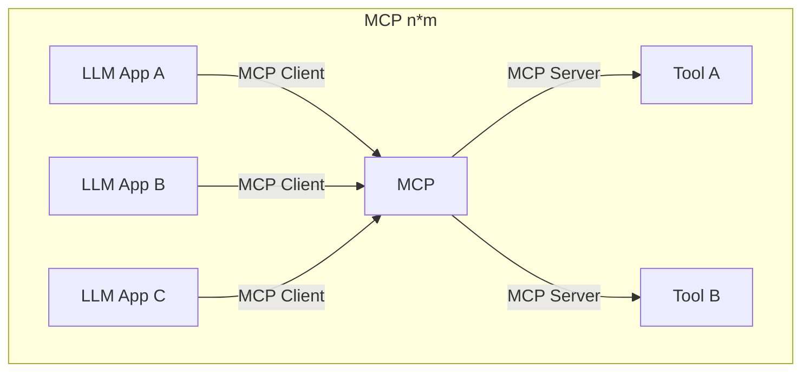
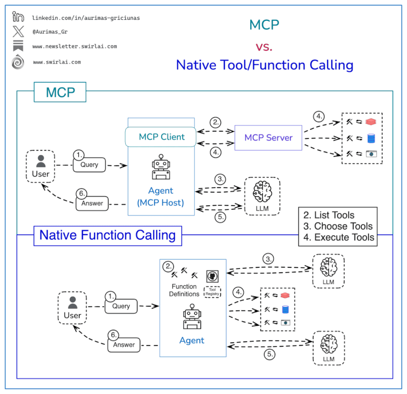
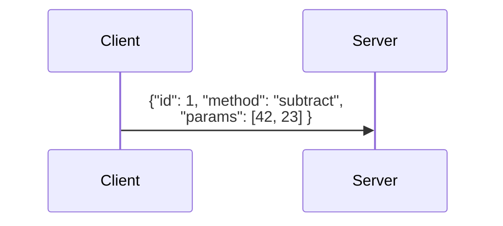
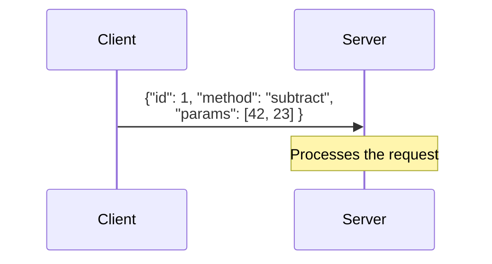
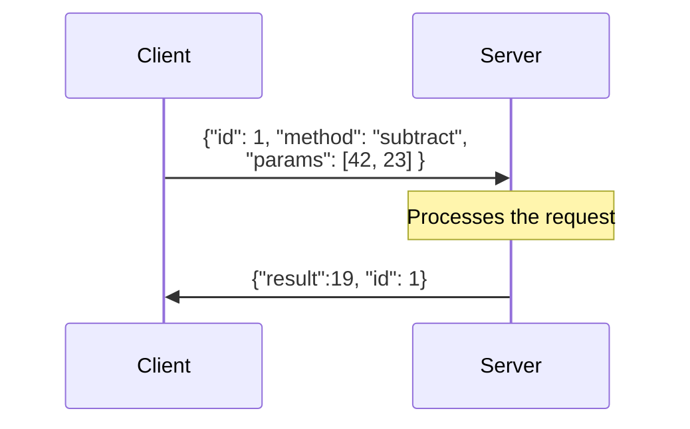
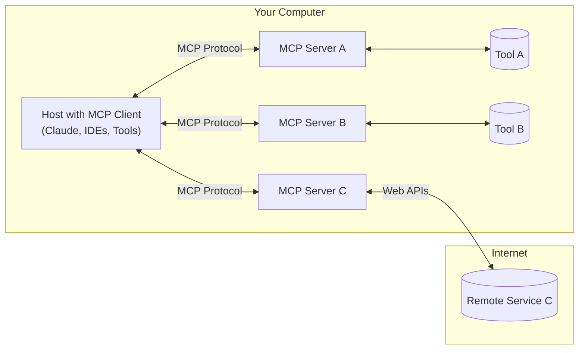
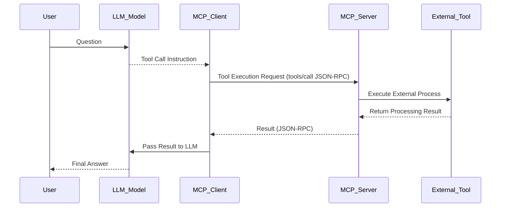
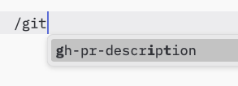
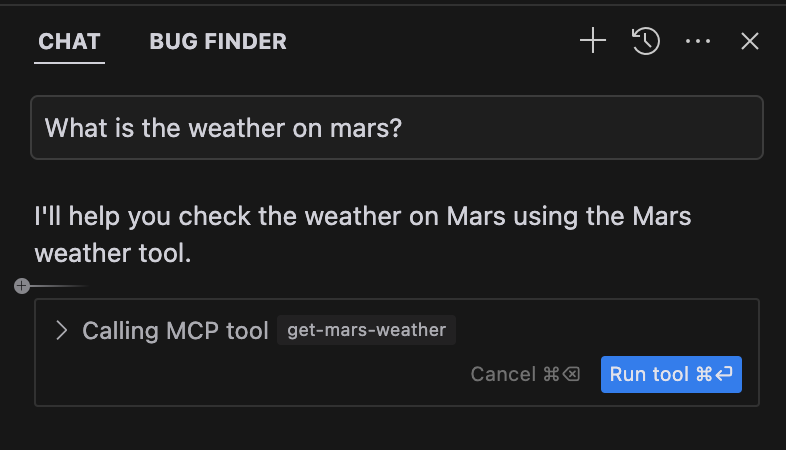

# Understanding MCP


---
layout: statement
---

# What is MCP?

- An open standard protocol proposed by **Anthropic** in November 2024.
- MCP acts as a universal adapter for AI applications, similar to how a **USB-C port** connects a **laptop** to various **devices**
- Provides standardized interface for seamless integration between LLMs and external `tools`, `resources` and `prompts`

<br>
<br>
Note

> MCP is not itself an "agent framework" but rather acts as a standardized integration layer for LLMs and tools/resources

<!--
Let me introduce you to the Model Context Protocol, or MCP for short.

MCP is an open protocol that was launched by Anthropic in November 2024. Its primary purpose is to provide standardized interfaces that enable seamless integration between Large Language Models and external data resources and tools.

What started as a protocol supporting only the Claude desktop application has rapidly evolved. Today, MCP has gained widespread adoption, with support from major AI editors including Cursor, Windsurf, and VS Code. It's quickly becoming the standard for connecting LLMs with the external world.
-->

---
layout: default
---

# Why MCP?

## **Before MCP**
- ❌ Tool builders needs to write the tools definition for **each LLM Provider**.
- ❌ LLM vendors needs to implement the tools definition for **client**.
- ❌ Integrating _n_ different LLMs with _m_ different tools required **n x m** different integrations.
- ❌ CLient/Host dons't have a standard way to integrate the tools.

## **After MCP**
- 🟢 Tool builders implement **one protocol**.
- 🟢 LLM vendors implement the **same protocol**.
- 🟢 MCP reduces integration complexity from an **N×M** to an **N+M** problem
- 🟢 Client/Host can use the same protocol to integrate the tools.

<!--
To understand its impact, let's look at the integration landscape before and after MCP:

Before MCP, if you wanted to integrate different LLM providers with various tools, you needed to create separate integrations for each combination. For example, if you had 5 different LLM providers and 10 different tools, you would need to create 50 different integrations.

With MCP, you only need to implement the protocol once. This single implementation can then be used by any LLM provider that supports MCP, dramatically simplifying the integration process and reducing development overhead.
-->

---
layout: default
---

# N*M 





---
layout: default
---

<div class="flex justify-center items-center flex-col">
<h1>Tools vs MCP</h1>

</div>

<!--
Image from Aurimas Griciunas

-->

---
layout: full
---

## Basic LLM MCP Client Integration

<Transform :scale="0.8">


````md magic-move

```js
// 1) Import the MCP client and transport
import { Client } from '@modelcontextprotocol/sdk/client/index.js';
import { StdioClientTransport } from '@modelcontextprotocol/sdk/client/stdio.js';

// 2) Define a LLMClient
class LLMClient {
  async sendMessage(messages, options = {}) {
    return {  id: 'msg_123', role: 'assistant', content: 'Sample LLM response', tool_calls: []};
  }
}

async function runBasicLLMIntegration() {
  // 2) Initialize MCP client
  const mcpClient = new Client(
    { name: 'BasicIntegrationClient', version: '1.0.0' }, { capabilities: { tools: {}, resources: {}, prompts: {} }}
  );
  
  // 3) Connect to MCP server
  const transport = new StdioClientTransport({ command: './server.js' });
  await mcpClient.connect(transport);
  await mcpClient.initialize();
  
  // 4) Setup and discover tools
  const llmClient = new LLMClient();
  const { tools } = await mcpClient.listTools();
  const formattedTools = tools.map(tool => ({
    name: tool.name, description: tool.description || `Tool: ${tool.name}`, parameters: tool.inputSchema
  }));
  
  // 5) Start conversation
  [...] 
}
runBasicLLMIntegration().catch(console.error);
```

```js

async function runBasicLLMIntegration() {
  // 1) Import the MCP client and transport

  // 2) Define a MCP client

  // 3) Initialize MCP client
  
  // 4) Connect to MCP server
  
  // 5) Setup and discover tools
  
  // 4) Start conversation
  const messages = [{ role: 'user', content: 'What tools are available?' }];
  const llmResponse = await llmClient.sendMessage(messages, { tools: formattedTools });
  
  // Handle tool calls
  if (llmResponse.tool_calls?.length) {
    for (const toolCall of llmResponse.tool_calls) {
      const toolResult = await mcpClient.callTool(toolCall.name, toolCall.arguments);
      
      messages.push(
        { role: 'assistant', content: null, tool_calls: [toolCall] },
        { role: 'tool', tool_call_id: toolCall.id, content: toolResult.content[0].text }
      );
      
      await llmClient.sendMessage(messages, { tools: formattedTools });
    }
  }
  
  await mcpClient.close();
}

runBasicLLMIntegration().catch(console.error);
```

````

</Transform>

<!--
MCP define the standard way to integrate LLM with tools, resources and prompts. But add more complexity to the integration.

Boilerplate code that is hidden in the client like Claude Desktop, Cursor, Windsurf, etc.

So if anyone is wondering, MCP doesn't simplify things but rather adds complexity with the trade-off of offering standardization. If someone prefers to use function calling, that's fine - it will work just the same
-->


---
layout: section
---

# Demo Time 🚀

## Tool registration and definition


<!--
But now let's see a real example of an MCP server and client in action.
https://github.com/langchain-ai/langchainjs/blob/main/libs/langchain-mcp-adapters/examples/calculator_server_shttp_sse.ts
-->

---
layout: default
---

# Technical Details of MCP specification

### Basic Architecture

-  **Client-Server:** is based on a classic client-server architecture:

-  **JSON-RPC Protocol:** uses JSON-RPC 2.0 format for message exchange

-  **Transport Layer:** Supports two transmission methods

    -  **STDIO** for local integrations.
    -  **SSE HTTP** for remote communications ( probably will be deprecated in the future).
    -  **Streamable HTTP** for remote communications ( probably will be the only supported remote transport layer in the future).

-  **Capability Negotiation:** At startup, client and server exchange information about supported functionalities (e.g., tools, resources, and prompts).

<!--
Let's dive deeper into the MCP specification.

MCP's architecture is built on two key components:

1. Client: Connects to the LLM, manages server connections, and executes tool calls
2. Server: Provides tools and capabilities through Python/JavaScript code, running locally or remotely

They communicate via JSON-RPC protocol, enabling the LLM to delegate tasks while focusing on reasoning.

-->

---
layout: default
---

# Handling calls and responses

## JSON-RPC Basics

<v-switch>
<template #1>

</template>

<template #2>



</template>
<template #3>

</template>
</v-switch>


<!--
JSON-RPC is a lightweight remote procedure call protocol.

The client send a formatted JSON to the server with id, method and params and the server process the request and send a response back to the client with id, result or error.
-->
---
layout: default
---

### JSON-RPC Message Format

1. **Requests:** ( Example `tools/list`)

```json
{
  "jsonrpc": "2.0", "id": 1, "method": "tools/list", "params": {}
}
```

2 **Responses:** ( Example `tools/list` response)

```json
{
  "jsonrpc": "2.0",
  "id": 1,
  "result": {
    "tools": [{ "name": "get_weather", "description": "Get current weather information for a location", "inputSchema": {}}],
    "nextCursor": "next-page-cursor"
  },
  "error": {} // or { code: number, message: string, data?: unknown }
}
```

3. **Notifications:** ( Example `notifications/tools/list_changed`)

```json
{
  "jsonrpc": "2.0",
  "method": "notifications/tools/list_changed",
  "params": {}
}
```

<!--
1. **Requests:** These expect a response. They include a `method` and optional `params`.
2. **Responses:** These are sent in response to requests. They include either a `result` (on success) or an `error` (on failure).
3. **Notifications:** These are one-way messages that don't expect a response. Like requests, they have a `method` and optional `params`.

-->


---
layout: default
---

# Main Components

-  **Hosts:** LLM applications (Claude Desktop, VsCode, Cursor, Windsurf) that provide the environment for connections.
- **Clients:** Components within the host that establish and maintain **one-to-one** connections with external servers.
- **Servers:** Separate processes that provide **resources, tools, and prompts** to these clients through the standardized protocol.


<!--
For simplicity we can merge the concept of Host and Client, because the host is the application that uses the LLM ( Claude Desktop, VsCode, Cursor, Windsurf) and the client is the component within the host that establishes and maintains a connection with the external server.
In the previous example, we used the mcp-server-math-calculator, that is a server that provides a calculator tool. This MCP server was configured using a mcp.json file, read by the host application.
-->

---
layout: default
---

# Popular MCP host

- **Cursor**
- **VS Code**
- **Windsurf**
- **RooCode** ( Vscode plugin)
- **Cline** ( VsCode plugin)
- **Claude Desktop**
- **Zed**
- **5ire**
- ...

Full table of MCP clients: https://modelcontextprotocol.io/clients

<!--
Now let's see some MCP client and server examples.
Most popular clients are Cursor, VS Code, Windsurf, RooCode, Cline, Claude Desktop.
As we discussed before, the client is the component within the host that establishes and maintains a connection with the external server. Can be a cli or a gui.
A partial list of clients are available on the MCP website. but if you search online you can find many more.
-->

---
layout: default
---

# Popular MCP servers

<Transform :scale="0.8">

- **Filesystem** - Secure file operations with configurable access controls
- **GitHub** - Repository management, file operations, and GitHub API integration
- **GitLab** - GitLab API for project management
- **Git** - Tools for reading, searching, and manipulating Git repositories
- **Google Drive** - File access and search capabilities for Google Drive
- **PostgreSQL** - Read-only database access with schema inspection
- **Sqlite** - Database interaction and business intelligence functionality
- **Slack** - Channel management and messaging capabilities
- **Sentry** - Issue retrieval and analysis from Sentry.io
- **Memory** - Persistent memory system based on knowledge graph
- **Puppeteer** - Browser automation and web scraping
- **Brave Search** - Web and local search using Brave Search API
- **Google Maps** - Location services, directions, and place details
- **Fetch** - Web content retrieval and conversion for efficient LLM usage

</Transform>


<!--
These are some of the most popular MCP servers provided by the community or by anthropic.
Latest progress includes Cloudflare offering remote MCP deployment capabilities and support for multiple language SDKs.

-->


---
layout: default
---

# MCP example diagram



---
layout: default
---

# Lifecycle of an MCP connection

1. **Initialization**: Host app creates n MCP clients that exchange capabilities and protocol versions through a handshake.
2. **Discovery**: Clients ask the server what it can do (`tools`, `resources`, `prompts`). Server responds with a list and descriptions.
3. **Context provision**: Host app can now show resources and prompts to users or convert tools into LLM-friendly format like **JSON Function calling**.
4. **Invocation**: When LLM needs a specific `tool` like `fetch_weather` (query: "What's the weather in Tokyo?"), Host tells Client to call the right Server.
5. **Execution**: Server gets the request (like `fetch_weather` for Tokyo), runs the code (calls OpenWeather API), and gets the result.
6. **Response**: Server sends the result back to Client.


https://github.com/cyanheads/model-context-protocol-resources/blob/main/guides/mcp-client-development-guide.md#basic-llm-integration


---
layout: default
---

# Flow 



---
layout: default
---

### Server-Side Primitives (Provided by Servers)

1.  **Prompts:**

    - Instructions or templates injected into the LLM context.
    - Guide how the model should approach specific tasks or data.

2.  **Resources:**

    - Structured data objects included in the LLM's context window, when the LLM think it's needed.
    - Allow the model to reference external information.

3.  **Tools:**
    - Executable functions the LLM can call.
    - Used to:
      - Retrieve information outside its context ( querying a database, calling an API).
      - Perform actions ( modifying a file, do some math calculations).

<!--
These are the **building blocks** for standardized communication.
Beyond tools, MCP offers two additional primitives to enhance LLM capabilities:

Resources:
- Inject external data into the LLM's context window (similar to RAG)
- Client-controlled: applications decide when and how to use them
- Examples: files, database records, API responses, system data, images
- Implementation varies by client (e.g., Claude Desktop requires manual selection)

Prompts:
- Reusable templates and workflows for LLM interactions
- User-controlled: explicitly selectable by users
- Standardize common LLM tasks and patterns
-->


---
layout: default
---


# Prompts

Prompts are designed to be **user-controlled**, meaning they are exposed from servers to clients with the intention of the user being able to explicitly select them for use.




The methods that client can call are:

- `prompts/list`: list all the prompts available.
- `prompts/get`: get a specific prompt by name.

And the notifications that client can receive from a server are:

- `notifications/prompts/list_changed`: notification that the list of available prompts changed.

<Transform :scale="0.85">

```json
{
  "jsonrpc": "2.0",
  "method": "notifications/prompts/list_changed"
}
```

</Transform>

---
layout: default
---

## Prompts example

```js {1|2-13|14-25|all}
const server = new Server({ name: "example-prompts-server", version: "1.0.0" }, { capabilities: { prompts: {} } });

const PROMPTS = {
  "git-commit": {
    name: "git-commit",
    description: "Generate a Git commit message",
    arguments: [{ name: "changes", description: "Git diff or description of changes", required: true }]
  }
};

// List available prompts
server.setRequestHandler(ListPromptsRequestSchema, async () => ({ prompts: Object.values(PROMPTS) }));

// Get specific prompt
server.setRequestHandler(GetPromptRequestSchema, async (request) => {
  if (request.params.name === "git-commit") {
    return {
      messages: [{
        role: "user",
        content: { type: "text", text: `Generate a concise but descriptive commit message for these changes:\n\n${request.params.arguments?.changes}` }
      }]
    };
  }
  throw new Error(`Prompt not found: ${request.params.name}`);
});

```


---
layout: default
---


# Resources

Resources in MCP are designed to be **application-driven**, with host applications determining how to incorporate context based on their needs.


The method that client can call are:

- `resources/list`, `resources/templates/list`: list all the resources or templates available.
- `resources/read` : read a specific resource by name.

And the notifications that client can receive from a server are:

- `notifications/resources/updated`: notification that the resource changed.
- `notifications/resources/list_changed`: notification that the list of available resources changed.


---
layout: default
---

## Resources example

```js {1|2-11|12-24|all}
const server = new Server({ name: "example-resources-server", version: "1.0.0" }, { capabilities: { resources: {} } });

// List available resources
server.setRequestHandler(ListResourcesRequestSchema, async () => ({
  resources: [{
    uri: "file:///logs/app.log",
    name: "Application Logs",
    mimeType: "text/plain"
  }]
}));

// Read resource contents
server.setRequestHandler(ReadResourceRequestSchema, async ({ params: { uri } }) => {
  if (uri !== "file:///logs/app.log") throw new Error("Resource not found");
  
  const logContents = await readLogFile();
  return {
    contents: [{
      uri,
      mimeType: "text/plain",
      text: logContents
    }]
  };
});
```


---
layout: default
---

## Tools

Tools in MCP allow servers to expose executable functions that can be invoked by clients and used by LLMs to perform actions.

The method that client can call are:

- `tools/list`: list all the tools available.
- `tools/call` : call a specific tool by name.

And the notifications that client can receive from a server are:

- `notifications/tools/updated`: notification that the tool changed.



---
layout: default
---

# Tool Example

```js {1|2-16|17-25|all}
const server = new Server({ name: "example-tools-server", version: "1.0.0" }, { capabilities: { tools: {} } });
// Define available tools
server.setRequestHandler(ListToolsRequestSchema, async () => ({
  tools: [{
    name: "calculate_sum",
    description: "Add two numbers together",
    inputSchema: {
      type: "object",
      properties: {
        a: { type: "number" },
        b: { type: "number" }
      },
      required: ["a", "b"]
    }
  }]
}));
// Handle tool execution
server.setRequestHandler(CallToolRequestSchema, async (request) => {
  if (request.params.name === "calculate_sum") {
    const { a, b } = request.params.arguments;
    return { content: [{ type: "text", text: String(a + b) }] };
  }
});
```


---
layout: default
---

# Client-Side Primitives (Used by Hosts/Clients)

1.  **Root Primitive:**

    - Think of it as creating a **secure channel for file access**.
    - Allows the AI application to safely work with local files (opening documents, reading code, analyzing data).
    - Crucially, it does this **without giving unrestricted access** to your entire file system.

2.  **Sampling Primitive:**
    - Enables a server to **request the LLM's help when needed**.
    - Example: An MCP server analyzing a database schema can ask the LLM to help formulate a relevant query.
    - This creates a **two-way interaction** where both AI and external tools can initiate requests.
    - Makes the system more **flexible and powerful**.

<!--
# Roots are a concept in MCP that define the boundaries where servers can operate. They provide a way for clients to inform servers about relevant resources and their locations.

When a client connects to a server, it declares which roots the server should work with. While primarily used for filesystem paths, roots can be any valid URI including HTTP URLs.

For example, roots could be:
- file:///home/user/projects/myapp
- https://api.example.com/v1

# Sampling primitive is used to enable a server to request the LLM's help when needed. 

This creates a two-way interaction where both AI and external tools can initiate requests. Since it's a very powerfull and critical even Claude Desktop doesn't implement it yet.
-->

---
layout: default
---


# Implementation and Integration of MCP servers

## Available SDKs and supported languages

<br>
<br>

- [Python](https://github.com/modelcontextprotocol/python-sdk)
- [Typescript](https://github.com/modelcontextprotocol/typescript-sdk)
- [Java](https://github.com/modelcontextprotocol/java-sdk)
- [C#](https://github.com/modelcontextprotocol/csharp-sdk)
- [Rust](https://github.com/modelcontextprotocol/rust-sdk)
- [Kotlin](https://github.com/modelcontextprotocol/kotlin-sdk)

<!--
Documentation: https://modelcontextprotocol.io/docs/ have some server and client examples
Usually the developers will create a server, expect if you want to create an AI Editor forking vscode. You can write mcp-server in typescript and use the typescript-sdk to create the server. or using python, java, csharp, rust or kotlin.
-->

---
layout: default
---

### Basic MCP server setup

Example of a `mcp.json` configuration file for a more complex mcp-server:

`.vscode/mcp.json`

<Transform :scale="0.9">
```json 
{
  // 💡 Inputs are prompted on first server start, then stored securely by VS Code.
  "inputs": [
    {
      "type": "promptString",
      "id": "perplexity-key",
      "description": "Perplexity API Key",
      "password": true
    }
  ],
  "servers": {
    // https://github.com/ppl-ai/modelcontextprotocol/
    "Perplexity": {
      "type": "stdio",
      "command": "npx",
      "args": ["-y", "@modelcontextprotocol/server-perplexity-ask"],
      "env": {
        "PERPLEXITY_API_KEY": "${input:perplexity-key}"
      }
    }
  }
}
```
</Transform>
<!--
Different clients will have different ways to configure the mcp.json file. The configurations is the same for all the clients, but the way to configure it is different. vscode call the root key "servers", cursor call the root key "McpServers", but in the case of another mcp client may be "mcp-servers" and so on.
-->

---
layout: section
---

# Demo Time 🚀

## [Anki MCP server](https://github.com/scorzeth/anki-mcp-server/blob/main/index.ts#L256)


<!--
In order to register a tool, we don't need to do anything special, we just need to define the tool in the mcp.json file and the server will automatically register it. If we want we can enable or disable the tool from the UI of the client. In some cases we should explicit ask to use the tool.
- https://github.com/scorzeth/anki-mcp-server/blob/main/index.ts#L256

-->


---
layout: default
---

# Example of a MCP server using STDIO

```ts
import { McpServer, ResourceTemplate } from "@modelcontextprotocol/sdk/server/mcp.js";
import { StdioServerTransport } from "@modelcontextprotocol/sdk/server/stdio.js";
import { z } from "zod";

// Create an MCP server
const server = new McpServer({
  name: "Demo",
  version: "1.0.0"
});

// Add an addition tool
server.tool("add", ""Adds two numbers together"", { a: z.number(), b: z.number() }, async ({ a, b }) => ({
    content: [{ type: "text", text: String(a + b) }]
  })
);

// Start receiving messages on stdin and sending messages on stdout
const transport = new StdioServerTransport();
await server.connect(transport);
```

<!--
In this way the mpc-server can be used only locally.
With the standard input ouput. The Host is running a process and it's hooking in the stdin and stdout of the process to send and receive messages from the mcp-server.

It's doin'g just an "npx @modelcontextprotocol/server-calculator"

This is not very usefull for now, because we can't use it only locally and the server need to be on the same machine of the host.

If you want to debug an mcp-server you can use the inspector tool.

-->

---
layout: default
---

# Example using HTTP Streamable

<Transform :scale="0.8">

```ts
const app = express();
app.use(express.json());

 /* set to undefined for stateless servers*/
const transport: StreamableHTTPServerTransport = new StreamableHTTPServerTransport({ sessionIdGenerator: undefined, });

// Setup routes for the server
const setupServer = async () => {await server.connect(transport) };
app.post("/mcp", async (req: Request, res: Response) => {
  console.log("Received MCP request:", req.body);
  try {
    await transport.handleRequest(req, res, req.body);
  } catch (error) {
    console.error("Error handling MCP request:", error);
    if (!res.headersSent) {
      res.status(500).json({
        jsonrpc: "2.0",  error: { code: -32603,  message: "Internal server error", }, id: null,
      });
    }
  }
});

// Start the server
const PORT = 3000;
setupServer()
  .then(() => { app.listen(PORT, () => { console.log(`MCP Streamable HTTP Server listening on port ${PORT}`) }) })
  .catch((error) => { console.error("Failed to set up the server:", error); process.exit(1) });

```
</Transform>

You can inspect the mcp-server using https://modelcontextprotocol.io/docs/tools/inspector

<!--
The other way to run an mcp-server is using HTTP Streamable as transport layer,

MCP protocol has recently switched from Server-Sent Events (SSE) to streamable HTTP as its transport method. This change brings important improvements:

- Stateless connections: No need for persistent connections between client and server for basic tool usage
- Lower overhead: More efficient for HTTP-based tool access (no need to manage /sse and /sse/messages endpoints)
- Flexibility: Still supports stateful connections when needed (e.g. for sampling capabilities)


- Communication through a single endpoint: All MCP interactions now flow through one endpoint, eliminating the need to manage separate endpoints for requests and responses, reducing complexity.

- Bi-directional communication: Servers can send notifications and requests back to clients on the same connection, enabling the server to prompt for additional information or provide real-time updates. 

- Automatic connection upgrades: Connections start as standard HTTP requests, but can dynamically upgrade to SSE (Server-Sent Events) to stream responses during long-running tasks.

https://blog.cloudflare.com/streamable-http-mcp-servers-python/

If you want to debug an mcp-server you can use the inspector tool.
-->


---
layout: default
class: slidev-code-background-transparent
lineNumbers: false
---

# System prompt with OpenAPI definition

````md magic-move {lines:false}

```
+----------------------------------------------------------------------+
| **System Prompt**                                                    |
|----------------------------------------------------------------------|
| You are a helpful assistant. You can use tools to help the user.     |
|                                                                      |
| {openapi_definition}                                                 |
+----------------------------------------------------------------------+
```

```
+----------------------------------------------------------------------+
| **System Prompt**                                                    |
|----------------------------------------------------------------------|
| You are a helpful assistant. You can use tools to help the user.     |
|                                                                      |
| You can use the following tools based on the OpenAPI definition:     |
| - api/v1/calculator?operations={operations}                          |
| - api/v1/web_search?query={query}                                  |
+----------------------------------------------------------------------+
```
````


<div class="flex justify-center items-center flex-col">

</div>


<!--
If LLM contains in the system prompt the list of tools, why we have to define a standard, to expose and run tools??

Since the magic of choosing the tools is behind the LLM, based on the context, why we have to define another standard, that expose an API called `tools/list` and `tools/get` called by the Client to the Server?

And not ask to LLM to answer with a JSON based on the OpenAPI definition?


Why not using OpenAPI definition?
-->


---
layout: section
---

# Why not using OpenAPI definition?

---
layout: default
---

# MCP Mindset
| OpenAPI  | MCP Server  |
|-----------------|-------------------|
| ❌ Dev-centric technical endpoints | 🟢 User-centric task-oriented tools |
| ❌ Missing business context | 🟢 Complete task-oriented capabilities |
| ❌ Unpredictable API call sequences | 🟢 Intentional workflow design |
| ❌ Poor tool selection by LLMs | 🟢 Clear semantic context for AI |

---
layout: default
class: slidev-code-background-transparent
---

## Example: Pizza Ordering System

<br>

- ❌ Bad approach: Separate tools for `list_pizzas`, `select_pizza`, `add_toppings`, `create_order` etc..
- 🟢 Good approach: Single `order_pizza` tool handling the entire process

<br>


````md magic-move {lines:false}


```md
❌ Bad approach:

| `list_pizzas`       | List available pizzas           |
| `select_pizza`      | Select a pizza from the menu    |
| `add_toppings`      | Add toppings to selected pizza  |
| `create_order`      | Create a new pizza order        |
| `pay_order`         | Process payment for the order   |
| `view_order_status` | Check the status of an order    |
| `cancel_order`      | Cancel an existing order        |
```

```md
🟢 Good approach:

| `order_pizza`       | Order a pizza with toppings     |
| `cancel_order`      | Cancel an existing pizza order  |
| `view_order_status` | Check the status of an order    |
```

````

<!--
The key insight is to think of the LLM as a human assistant using your application. You wouldn't give a human user direct access to every API endpoint instead, you create intuitive UI elements that guide them through specific workflows.

## Because LLM dosn't know in which order to use the tools, we need to guide them through specific workflows.

This is just an example, but you can think on some more complex workflows that can be useful for the users like a long onboarding process or a complex workflow that can be done in a single tool call.

## Of course, one could use an agent that knows how to use tools sequentially through a system prompt, even starting from an OpenAPI definition, but that's a different approach.

## Tool Design Principles

1. **Simple Cases**
   - Direct API mapping (e.g., "delete order", "update post")

2. **Complex Workflows**
   - Single tool for multi-step processes
   - Example: "purchase ticket" = reserve + add details + process payment + send confirmation

3. **User-Centric Actions**
   - Bundle related operations into meaningful tools
   - Example: "onboard new team member" instead of separate create/assign/send tools

-->
